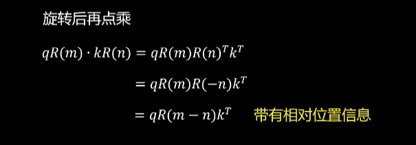
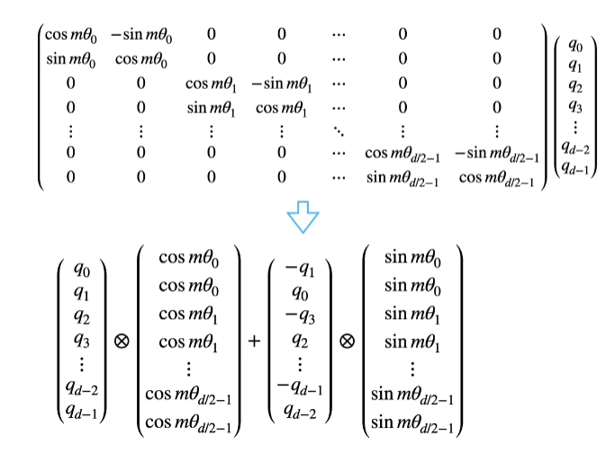
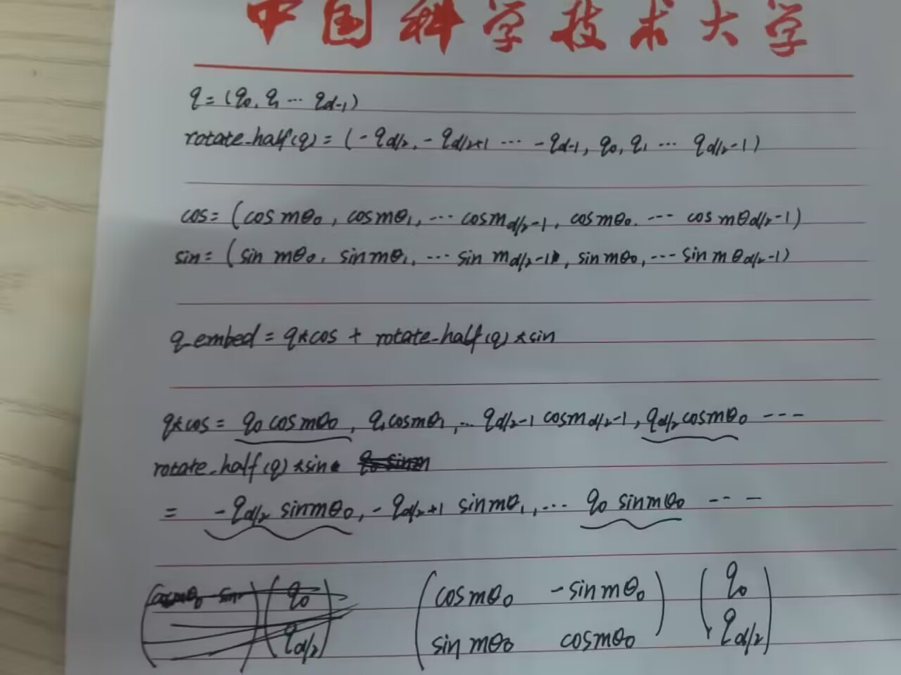
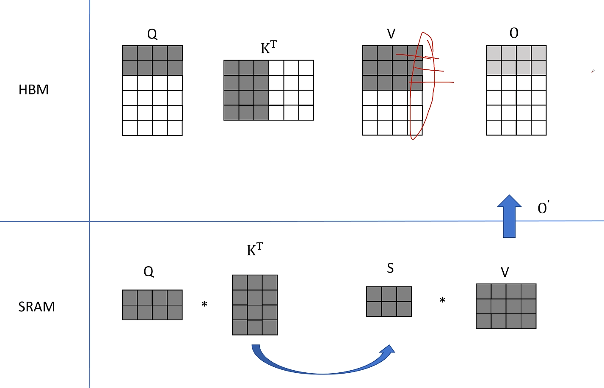
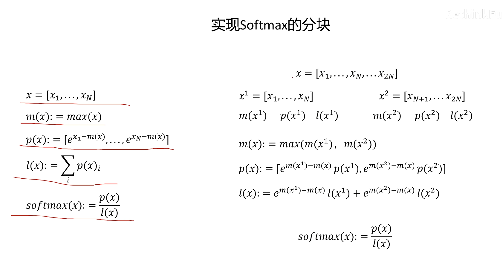
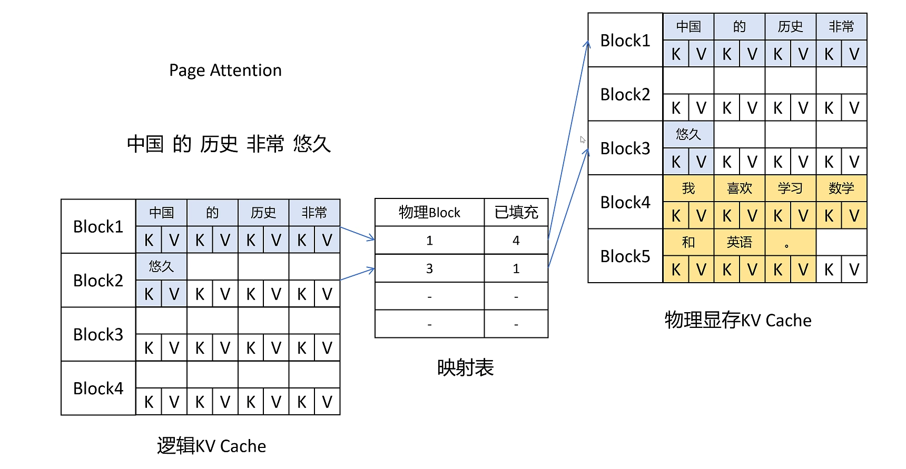
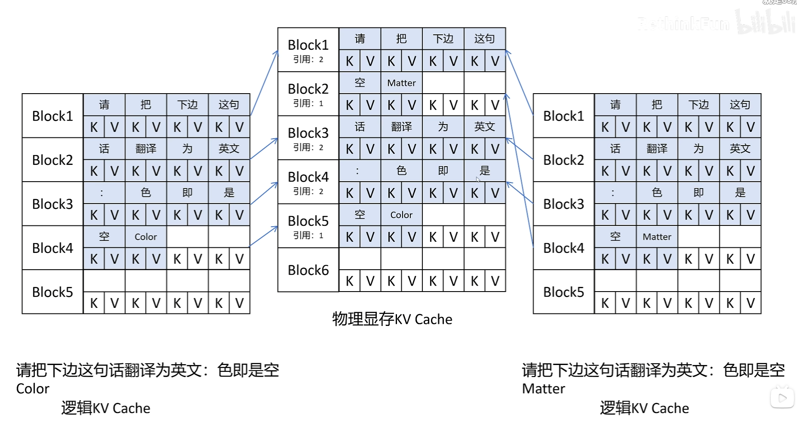
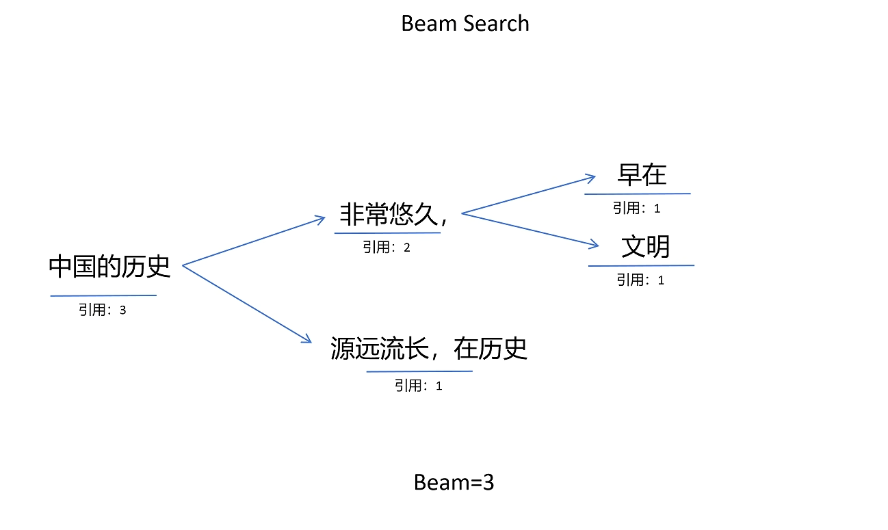

# Others

在github网页上显示公式似乎有点问题，在vscode以及pycharm中正常。  

## 1.GQA(Grouped query attention)

在推理阶段，生成第 ``i+1`` 个 token 时，需要前``i``个token的 $K(W_k\times X)$ 和 $V(W_v\times X)$，以及第 ``i`` 个 token 的 $Q(W_q\times X)$。  
为了避免每次生成新 token 时重复计算 $K$ 和 $V$ ，将每个 token 的 $K$ 和 $V$ 保存下来，即 KV Cache。

但是存储每个 token 的 $K、V$ 矩阵对内存占用较高，对于 `num_heads=8` 的多头注意力机制，可以将每两个 head 分为一组，共享相同的 $W_k$ 和 $W_v$ 矩阵，而每组内的 $W_q$ 矩阵保持独立。  
这样每组中的head生成相同的 $K$ 和 $V$，但具有不同的查询向量 $Q$。减少内存占用的同时（**也许**）也能减少矩阵乘法的次数 ($W_k\times X、W_v\times X、Q\times K^T$).  

**若将所有head分为一组，共享 $W_k$ 和 $W_v$，则为MQA(Multi-Query Attention)。**
这相当于不同Head的Attention差异，全部都放在了Query上，需要模型仅从不同的Query Heads上就能够关注到输入hidden states不同方面的信息。这样做的好处是，极大地降低了KV Cache的需求，但是会导致模型效果有所下降。

## 2.RoPE

传统的在Embedding上加入位置编码，而RoPE在Q、K矩阵上加入位置编码。

### 2.1假设词嵌入为二维  

对于 token $x_m$，$x_n$ ，有：  
$$x_m'=W_qx_me^{im\theta}=q_me^{im\theta}$$  
$$x_n'=W_kx_ne^{in\theta}=k_ne^{in\theta}$$  
其中 $m$ 和 $n$ 分别是 token 的位置，$i$ 是虚数单位。  
将 q_m 与 k_n 表示为复数，有：  
 $$q_m=q_m^1+iq_m^2$$  
 $$k_n=k_n^1+ik_n^2$$  
而根据欧拉公式，有：  
 $$e^{i\theta}=cos\theta+isin\theta$$   
则：  
 $$q_me^{im\theta}=(q_m^1+iq_m^2)(cosm\theta+isinm\theta)$$   
 $$q_me^{im\theta}=(q_m^1cosm\theta-q_m^2sinm\theta)+i(q_m^1sinm\theta+q_m^2cosm\theta)$$   
再表示为向量形式：  
 $$q_me^{im\theta}=\begin{bmatrix}cosm\theta & -sinm\theta\\sinm\theta & cos\theta\end{bmatrix}\begin{bmatrix}q_m^1\\q_m^2\end{bmatrix}$$   
同理：  
 $$k_ne^{in\theta}=\begin{bmatrix}cosn\theta & -sinn\theta\\sinn\theta & cos\theta\end{bmatrix}\begin{bmatrix}k_n^1\\k_n^2\end{bmatrix}$$   
故：  
 $$x_m'^Tx_n'=(q_me^{im\theta})^T(k_ne^{in\theta})=\begin{bmatrix}q_m^1 & q_m^2\end{bmatrix}\begin{bmatrix}cosm\theta & -sinm\theta\\sinm\theta & cos\theta\end{bmatrix}^T\begin{bmatrix}cosn\theta & -sinn\theta\\sinn\theta & cos\theta\end{bmatrix}\begin{bmatrix}k_n^1\\k_n^2\end{bmatrix}$$   
化简得：  
 $$x_m'^Tx_n'=\begin{bmatrix}q_m^1 & q_m^2\end{bmatrix}\begin{bmatrix}cos((m-n)\theta) & -sin((m-n)\theta)\\sin((m-n)\theta) & cos((m-n)\theta)\end{bmatrix}\begin{bmatrix}k_n^1\\k_n^2\end{bmatrix}$$   
直接从位置函数的角度考虑：  
 $$g(x_m'^T,x_n',m-n)=Re[(W_qx_m)^T(W_kx_n)^*e^{i(m-n)\theta}]$$   
其中 Re 表示取实部，$x^*$表示共轭，$m-n$表示位置差。  
  
如图，在二维空间中，q 被旋转了 m 角度，k 被旋转了 n 角度，两者的点积就是他们在旋转后的位置的点积。  
 $R(m)R(n)^T$即为先旋转 m 角度，再旋转 -n 角度，等价于旋转 m-n 角度。  

### 2.2推广到多维

两两一组，如图所示：  
  
其中 $\theta_i=1/ \text{base}^{2i/d}$ ，基础版本 $\text{base}=10000$ ，如果是动态RoPE则 $\text{base}=\text{base}_0\times((\frac{\text{factor}\times seqlen}{maxlen}-(\text{factor}-1)))^{\frac{dim}{dim-2}}$     
图中将相邻的 $q_i$ 和 $q_{i+1}$ 分为一组旋转，而代码中将 $q_i$ 和 $q_{i+\frac{d}{2}}$ 作为一组。  
  
代码在初始化阶段先根据 `head_dim` 计算了inv_freq，shape为(d/2)，即公式中的 $\theta_i$   
 $$(\theta_0, \theta_1, ... ,\theta_{d/2-1})$$   
在forward阶段，`position_id` 为
 $$(0, 1, 2, ... , seq_len)$$   
和inv_freq一起reshape之后广播按位相乘得到freq  
 $$\begin{matrix}
    m_0\theta_0 & m_0\theta_1 & ... & m_0\theta_{d/2-1}
    \\
    m_1\theta_0 & m_1\theta_1 & ... & m_1\theta_{d/2-1}
    \\
    ...
    \\
    m_{len-1}\theta_0 & m_{len-1}\theta_1 & ... & m_{len-1}\theta_{d/2-1}
\end{matrix}$$   
freq复制一份(freq cat freq)得到emb 
 $$\begin{matrix}
    m_0\theta_0 & ... & m_0\theta_{d/2-1} & m_0\theta_0 & ... & m_0\theta_{d/2-1}
    \\
    m_1\theta_0 & ... & m_1\theta_{d/2-1} & m_1\theta_0 & ... & m_1\theta_{d/2-1}
    \\
    ...
    \\
    m_{len-1}\theta_0 & ... & m_{len-1}\theta_{d/2-1} & m_{len-1}\theta_0 & ... & m_{len-1}\theta_{d/2-1}
\end{matrix}$$   
逐位做cos和sin，在 `apply_rotary_pos_emb` 函数中分别与q，k以及变换后的q、k逐位相乘，得到带位置信息的q，k  

## 3.SwiGLU(Switched Gated Linear Unit)

| 激活函数 |                         公式                         |                     特点                      |
| :------: | :--------------------------------------------------: | :-------------------------------------------: |
|   GLU    |     $GLU(x)=(xW_1+b_1)\times \sigma (xW_2+b_2)$      |          使用Sigmoid，计算复杂的较高          |
|   GELU   |              $GELU(x)=x\times \Phi(x)$               |            平滑激活，但无门控机制             |
|  SwiGLU  | $SwiGLU(x)=Swish_\beta (xW_1+b_1) \times (xW_2+b_2)$ | 引入 Swish 和门控机制，性能优异，计算效率较高 |

其中$\Phi (x)$为伯努利分布，$Swish_\beta(x)=x \times \sigma (\beta x)$，$\beta$ 为可学习参数，GLU与SwiGLU中都是矩阵逐元素相乘。  

## 4.MOE(Mixture of Experts)

核心思想是稀疏激活（Sparse Activation），即并不是每次都激活所有专家，而是根据输入动态选择部分专家来参与计算。  
每个“专家”其实是一个较小的子模型（例如一个小型的神经网络），这些专家能够针对不同的数据分布或者任务表现出更好的性能。

## 5.Dense Transformer

即标准Transformer，每个位置都会和所有其他位置进行交互，这种全连接的方式会导致计算复杂度随序列长度的平方增长。

## 6.RMSNorm

新的归一化方法。  
对于一个输入向量 $x$，RMSNorm 的计算公式如下：  
$$RMS(x)=\sqrt {\frac{1}{d} \sum_{i=1}^d x_i^2 + \epsilon}$$  
$$\hat x=\frac{x}{RMS(x)}$$  
$$RMSNorm(x)=g \times \hat x$$  
其中 $g$ 是可学习的缩放参数，$\epsilon$ 是一个很小的数，用于防止分母为 0。  
  
原LayerNorm的计算公式如下：  
$$LayerNorm(x)=g \times \frac{x-\mu}{\sqrt{\sigma^2+\epsilon}}+\beta$$  
其中 $\mu$ 是均值，$\sigma$ 是标准差，$g$ 和 $\beta$ 是可学习的缩放和偏移参数。  

## 7.FlashAttention

传统self-attention中，假设 $Q$、$K$ 的维度为 $d$，序列长度为 $n$，则计算复杂度为 $O(n^2d)$ (weight 矩阵为 $n \times n$，每个位置需要 $d$ 次乘法并求和)，空间复杂度为 $O(n^2)$。

FlashAttention在IO维度上加速Attention的计算。将 $Q$、$K$、$V$ 按对应的维度进行分块，每次得到小的 weight，并直接计算 Output 的一部分，从而避免在HBM中保存 Weight 矩阵。  
  
- safeSoftmax及其分块    
保证在计算softmax时不会出现数值溢出(FP16混合精度)的情况。  
在分块得到O的情况下仍能计算出正确的结果。  
  
计算量稍微增加，但IO量大幅减少，运行时间大幅减少。  

## 8.COT(Chain of Thought)

过引导模型逐步推理和生成中间步骤，从而提高模型在复杂任务上的表现。COT的核心思想是将复杂问题分解为一系列简单的步骤，逐步解决每个步骤，最终得到问题的答案。  

## 9.Page Attention(VLLM)

借鉴操作系统中的虚拟内存和页管理技术，将显存划分为KV block，即操作系统中的最小单元（页），按KV block来管理KV Cache。  

KV blocks 共享：N个相同的prompt时，在物理KV Cache中只存一份，并标记block的引用数，开始生成时，若生成的token要放入的block引用大于1，则拷贝一份到新的block中再写入。  

此事在 beam search 中亦有记载。

