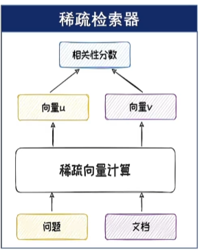
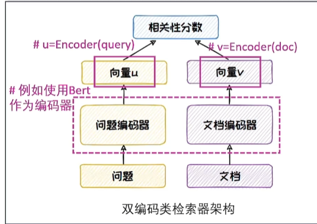
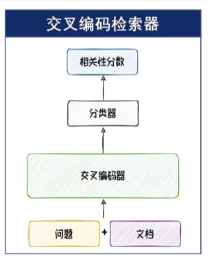
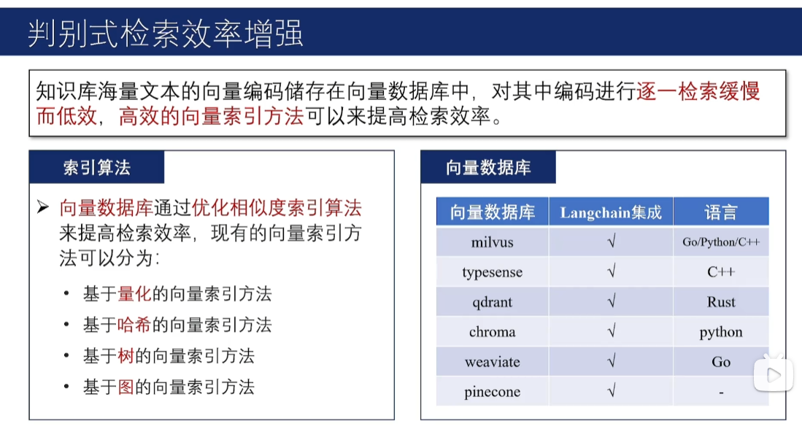
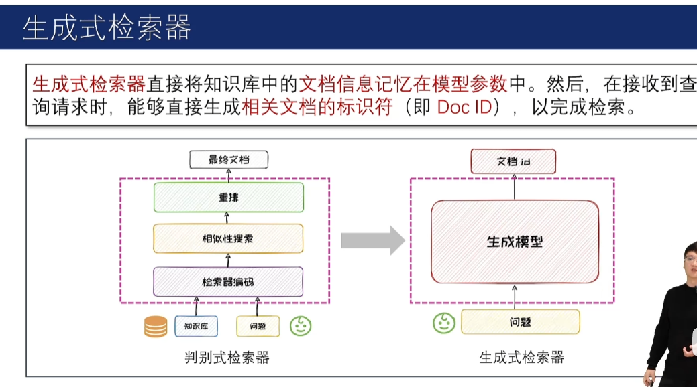
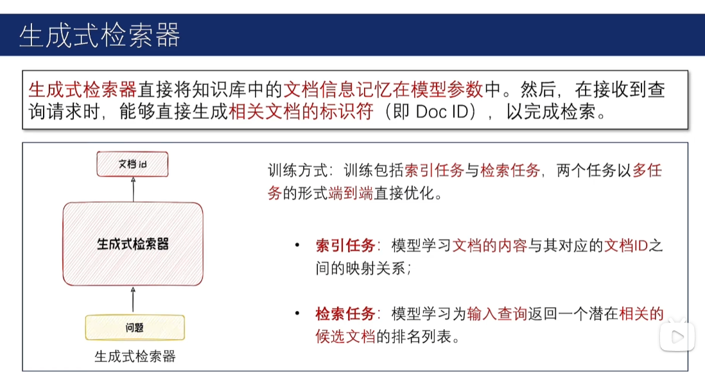
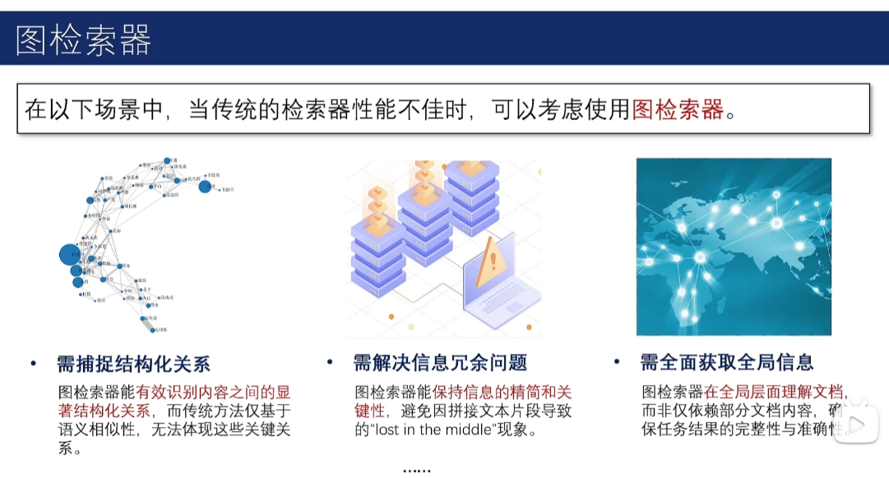
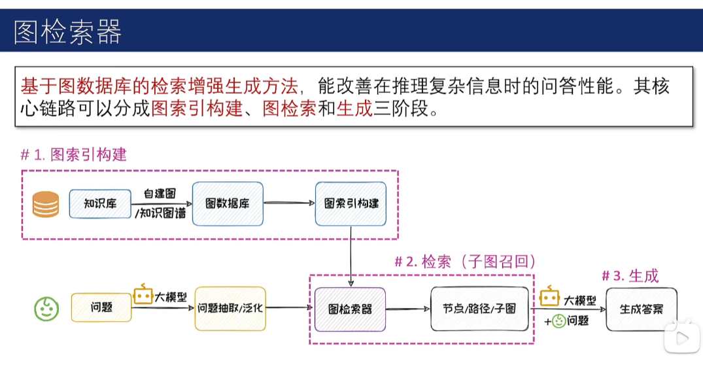
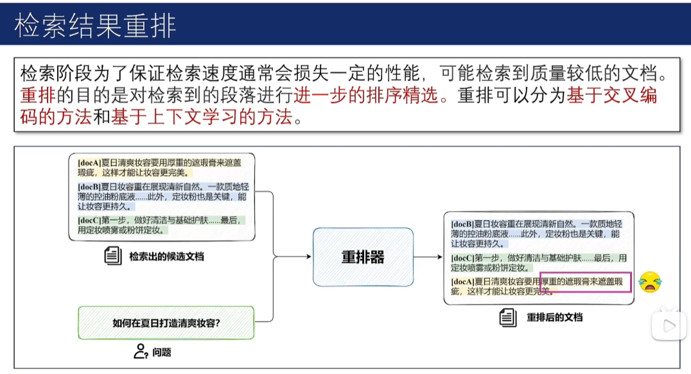
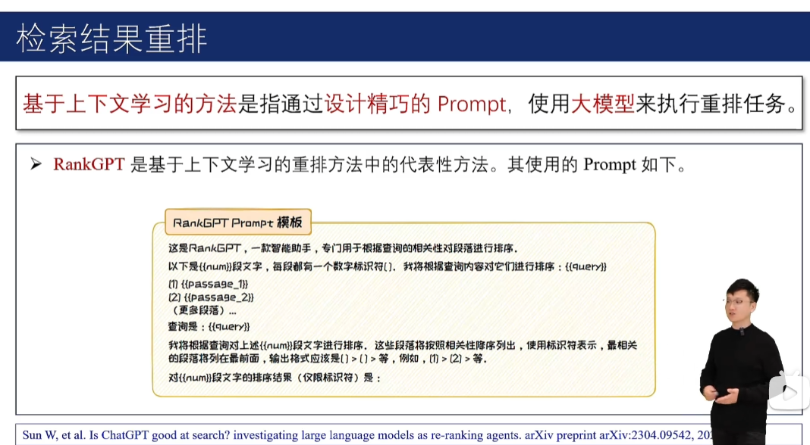

# RAG

## 黑盒模型

1. 不微调检索器

2. 微调检索器

## 白盒模型

1. 微调模型

2. 微调模型和检索器

## 检索器
根据问题检索出对应文档  

### 判别式检索器(主流)

#### 稀疏检索器

##### TF-IDF  
基于词频(TF)和逆文档频率(IDF)来衡量词语在语料库中的重要性，然后根据此重要性对文本进行编码。

$$
idf_i = \log \frac{|D|}{|d_i|}
$$
其中 $|D|$ 为总文档数，$|d_i|$ 为包含词语 $i$ 的文档的个数。  
$idf_i$ 表示词语 $i$ 在所有文档中的不普遍性。

$$
tf_{i,j} = \frac{n_{i,j}}{\sum_k n_{k,j}}
$$
其中 $n_{i,j}$ 为词语 $i$ 在文档 $j$ 中出现的次数，$\sum_k n_{k,j}$ 为文档 $j$ 中的总词数。  
$tf_{i,j}$ 表示词语 $i$ 能代表文档 $j$ 的程度。

$$
tfidf_{i,j} = tf_{i,j} \times idf_i
$$
若词语 $i$ 能较好地代表文档 $j$，且词语 $i$ 在所有文档中不怎么普遍出现，则词语 $i$ 的重要性 $tfidf_{i,j}$ 较高。

#### 双编码检索器(稠密)

优点：解耦，可以给文档离线编码  
缺点：两个编码器没有关联，自说自话  
#### 交叉编码检索器

优点：问题＋文档关联  
缺点：效率低  

---  
一般用稀疏检索器或双编码检索器做召回，再用交叉编码检索器做精排  
优化方法：

### 生成式检索器(不成熟)

### 图检索器

### 检索结果重排

